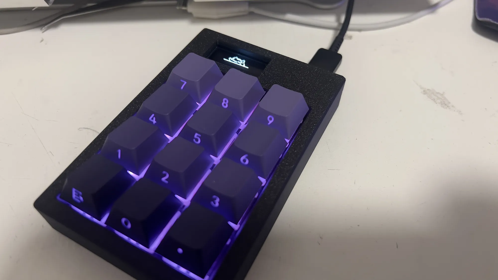

# 12-Key RP2040 Hackpad

A custom 12-key macropad.
- Seeed XIAO Rp2040
- Per-key RGB
- 32x128 OLED Display
- 3DP Case

Firmware:
- Acts as a numpad
- Led pulses under key when pressed
- Oled plays cat gif forever

Note: To upload a custom animation, you can use the gifToBitmap.py file to convert any gif (as long as its 32px tall and less than or equal to 128px wide. Then you must upload it to the animation_bmps folder on the rp2040.)

---

## Overall Hackpad

---

## Firmware
Firmware located in the Deploy folder. 

---

## Schematic

---

## PCB
**KiCad Layout**  

**PCB 3D View**  

---

## Case Design
**Case CAD**  

---

## BOM // proper bom with links is a seperate file

| Part | Quantity |
|----|----|
| Seeed XIAO RP2040 | 1 |
| MX-Style Switches | 12 |
| Through-hole 1N4148 Diodes | 12 |
| SK6812 MINI-E LEDs | 12 |
| 0.91" OLED Display | 1 |
| Blank DSA Keycaps | 12 |
| M3×16 mm Screws | 4 |
| M3×5 mm Heatset Inserts | 4 |
| Case Top | 1 |
| Case Bottom | 1 |
