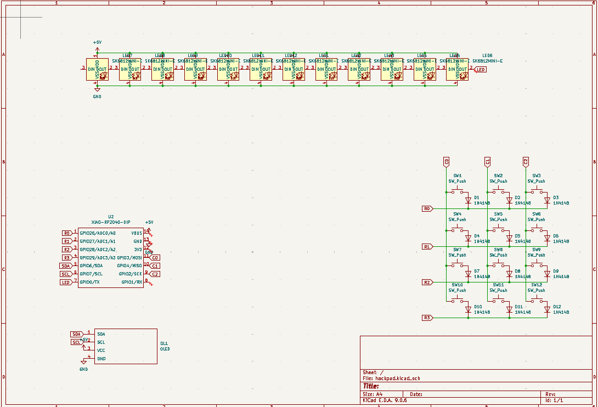
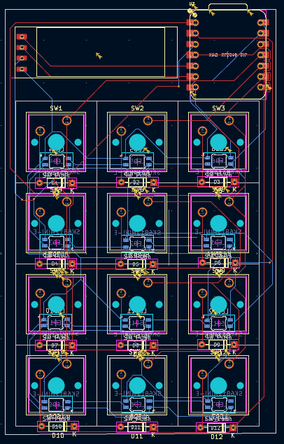
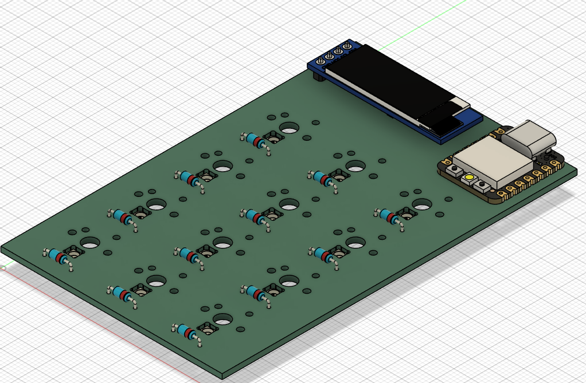
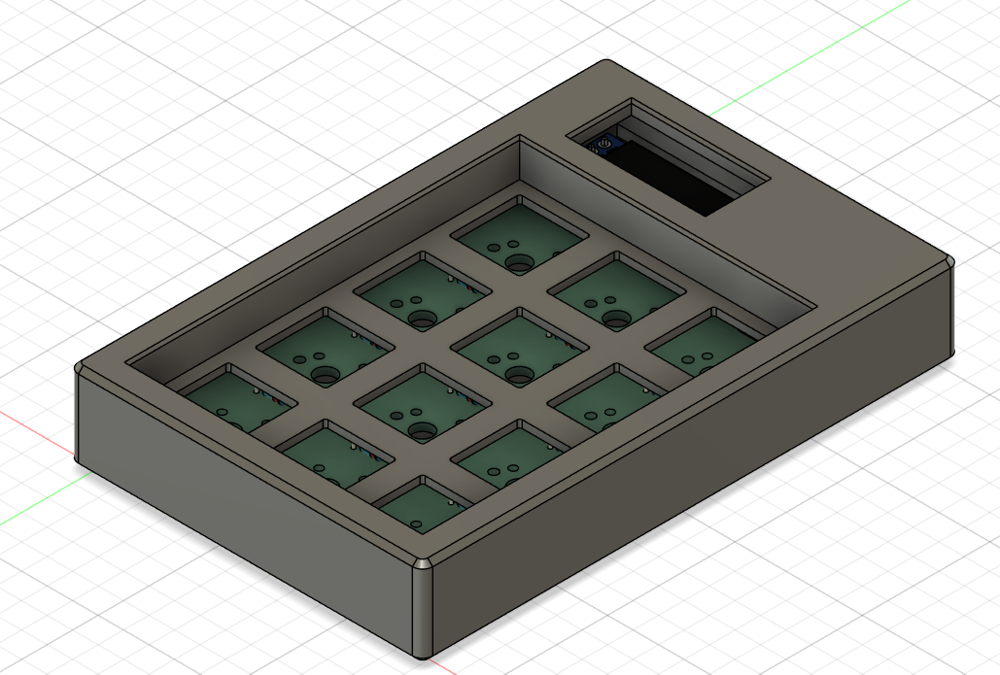

<h1 align="center">12-Key RP2040 Hackpad</h1>

  A custom 12-key macropad built around the Seeed XIAO RP2040, featuring per-key RGB, an OLED display, and a 3D printed case.

  

<h2>Motivation</h2>
<ul>

This Hackpad began as a simple volume controller. It evolved into a fully-featured macropad focused on:

- Speeding up workflows
- Reducing repetitive actions
- Providing intuitive visual feedback
- Maximizing functionality within hardware constraints

</ul>

<h2>Project Highlights</h2>
<ul>

- Dual-core RP2040 at up to 133MHz via the compact Seeed XIAO form factor
- Per-key RGB lighting using SK6812 MINI-E reverse-mount LEDs for clean underglow
- 0.91" OLED display for real-time visual feedback and animations
- Keyboard matrix protected by 1N4148 diodes for reliable n-key rollover
- Brass heatset inserts for durable, reusable screw connections in the 3D printed case
- Compact 12-key layout in a custom 3D printed two-piece shell

</ul>

<h2>Firmware Features</h2>
<ul>

- Acts as a USB numpad  
- LED pulses under each key when pressed  
- OLED plays a cat GIF on loop  

</ul>

<h2>PCB & Schematic</h2>

  
   <em>Schematic</em>

  
   <em>PCB Layout (KiCad)</em>

  
   <em>PCB 3D Render</em>

<h2>Case Design</h2>

  
   <em>Case CAD</em>

<h2>Bill of Materials</h2>

> A full BOM with pricing and purchase links is available as a separate file.

| Part | Quantity |
|------|----------|
| Seeed XIAO RP2040 | 1 |
| MX-Style Switches | 12 |
| Through-hole 1N4148 Diodes | 12 |
| SK6812 MINI-E LEDs | 12 |
| 0.91" OLED Display (SSD1306 I2C 128×32) | 1 |
| Blank DSA Keycaps | 12 |
| M3×16 mm Cap Head Screws | 4 |
| M3×5 mm Brass Heatset Inserts | 4 |
| 3D Printed Case Top | 1 |
| 3D Printed Case Bottom | 1 |

<h2>Firmware</h2>

Firmware is located in the `Deploy` folder. Flash directly to the RP2040 via USB drag-and-drop.

<h2>Acknowledgements</h2>
<ul>

- Good people of Hack Club  

</ul>
